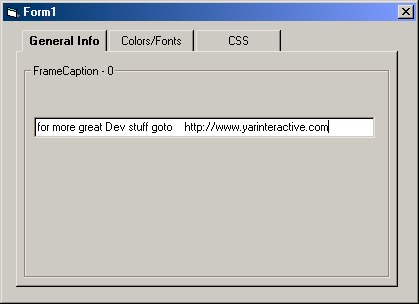



## Create your own TABBED DIALOG WITHOUT any OCXs/API\! IMPROVED\!

### Description

This is an IMPROVED version of my other "Create your own tabbed dialog" like the other this code lets you create a tabbed dialog (like the tabs used in property pages) without using any OCX/API!

In this version, I've gotten rid of that dotted focus box that used to appear on a tab when it was selected, and to make it look EVEN BETTER, as an option, the selected tabb will turn BOLD.

(SEE SCREEN SHOT) Please VOTE! Happy Programming! :)

Any comments would be appreciated! please vote.
 
### More Info
 

             |
---                |---
**Submitted On**   |1999-11-19 17:47:24
**By**             |[\(Tim Miron\) yar\-interactive software](https://github.com/Planet-Source-Code/PSCIndex/blob/master/ByAuthor/tim-miron-yar-interactive-software.md)
**Level**          |Intermediate
**User Rating**    |4.4 (31 globes from 7 users)
**Compatibility**  |VB 6\.0
**Category**       |[Miscellaneous](https://github.com/Planet-Source-Code/PSCIndex/blob/master/ByCategory/miscellaneous__1-1.md)
**World**          |[Visual Basic](https://github.com/Planet-Source-Code/PSCIndex/blob/master/ByWorld/visual-basic.md)
**Archive File**   |[CODE\_UPLOAD1185111192000\.zip](https://github.com/Planet-Source-Code/tim-miron-yar-interactive-software-create-your-own-tabbed-dialog-without-any-ocxs-api-impr__1-12957/archive/master.zip)

